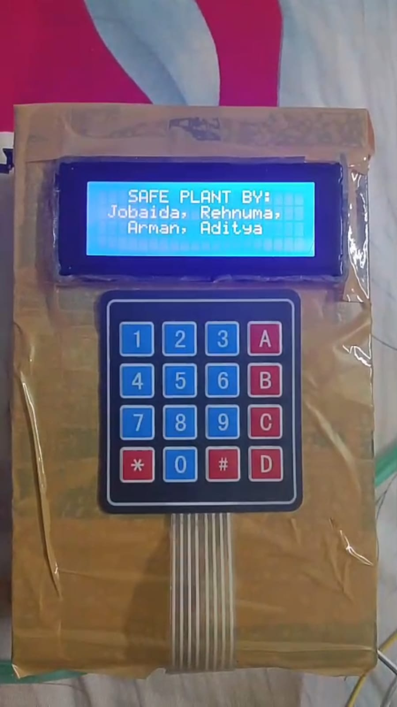
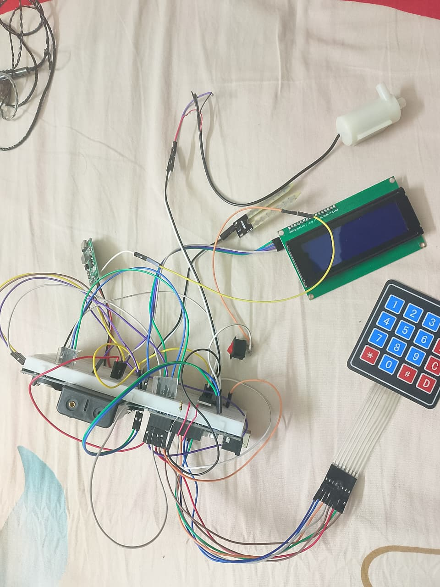

# ShechBot: Smart Automated Plant Watering System 🌿🤖

**Creators:** Jobaida, Rehnuma, Arman, & Aditya

  

## 📖 Overview
ShechBot is an Arduino UNO-based smart automated plant watering system designed for precision irrigation. It operates as a fully standalone, battery-powered (7.4 V Li-ion) device without the need for cloud dependency. The system features a dual-mode control architecture governed by a finite-state machine (FSM) written in C++. 

All configuration is performed locally via a 20x4 LCD and 4x4 keypad, allowing users to adjust settings in the field without requiring reprogramming. System parameters are persistently stored in the microcontroller's EEPROM using an XOR checksum validation scheme to survive power outages.

## ✨ Key Features
* ⏱️ **Time-Based Mode:** A DS3231 RTC triggers watering at a user-configured hour and minute (calibrated to Bangladesh Standard Time), checking soil moisture first to prevent unnecessary watering.
* 💧 **Moisture-Based Mode:** Continuously polls an analog soil sensor and automatically activates the pump when moisture falls below a target threshold, featuring a 5-minute cooldown to prevent flooding.
* 🔋 **Battery Monitoring:** A resistive voltage-divider circuit (10 kΩ / 2.2 kΩ) continuously maps the battery pack voltage to a 0-100% charge estimate displayed live on the LCD.
* 💾 **Reliability & Power Saving:** Features flyback protection, PWM ramp-up for the pump, and a 60-second LCD screen-saver to extend battery life during unattended operation.

## 🛠️ Hardware Architecture

| Component | Specification / Model | Function in System |
| :--- | :--- | :--- |
| **Microcontroller** | Arduino UNO (ATmega328P) | Central processor executing all system logic. |
| **RTC Module** | DS3231 (±2 ppm TCXO) | Maintains Standard Time for scheduling. |
| **Power Transistor**| MOSFET IRFZ44N | Amplifies gate signal to drive the water pump. |
| **Protection Diode**| 1N4007 | Flyback diode; suppresses reverse EMF at cutoff. |
| **Soil Sensor** | Analog capacitive sensor | Reads live soil moisture (mapped 0-100%). |
| **Resistors** | 10 kΩ / 2.2 kΩ | Voltage divider for battery voltage measurement. |
| **Display** | 20x4 I2C LCD (0x27) | Shows menus, live readings, and system status. |
| **Keypad** | 4x4 Matrix Keypad | User input for navigation and configuration. |
| **Power Supply** | 7.4 V Li-ion pack | Portable rechargeable power supply. |
| **Charger** | 2S Li-ion charger board | Safely recharges the battery in the field. |

## 🔌 Circuit & Wiring Reference

  

## ⚙️ Interactive Menu & Keypad Navigation
The system is navigated using the following key mappings:
* `[A]` - Enter Time-Based Monitoring Mode
* `[B]` - Enter Moisture-Based Monitoring Mode
* `[C]` - Set Scheduled Watering Time (Hour → Minute)
* `[D]` - Set Target Soil Moisture Threshold (%)
* `[0]` - Set Pump Run Duration (seconds)
* `[*]` - View Live Battery Status
* `[#]` - Return to Main Menu / Confirm / Exit current screen

## 🚀 Installation
1. Clone the repository.
2. Open `src/ShechBot.ino` in the Arduino IDE.
3. Install required libraries: `Wire`, `LiquidCrystal_I2C`, `RTClib`, `Keypad`, and `EEPROM`.
4. Compile and upload to the Arduino UNO.

## ⚠️ Known Limitations
1. **Loose Wiring Connections:** Breadboard contacts may develop resistance under pump vibration, causing erratic readings. *Fix:* Solder all connections to a custom PCB and add strain relief.
2. **RTC Coin-Cell Depletion:** The DS3231 CR2032 battery drains over months, leading to scheduling errors. *Fix:* Monitor VBAT pin and display a low-battery warning on the LCD.
